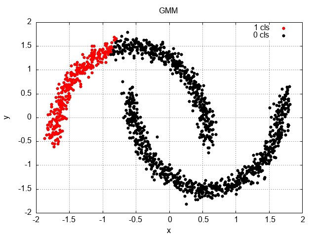
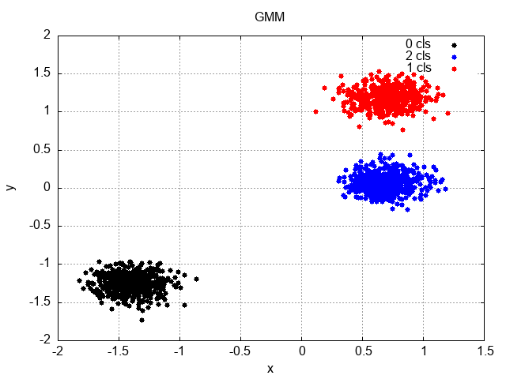

# Clustering Templates
Experiments in unsuperised clustering techniques using the
[mlpack](https://en.wikipedia.org/wiki/Mlpack) libraries.  The `mlpack` libraries are
built upon the [Armadillo](https://en.wikipedia.org/wiki/Armadillo_%28C%2B%2B_library%29) libraries
providing linear algebra functions.  The templates provide a hello-world
examples for measuring the distance in clustering and sampling some of the 
clustering techniques.

## Types Used
- GMM - Clustering using Gaussian distribution to determine fit
- KMeans - Similarity groupings
- DBScan - Density-Based Spatial Clustering of Applications with Noise
- MeanShift - Non-parametric, density-based clustering algorithm where clusters have arbitrary shapes and are not well-separated by linear boundaries.

## Results

|               DataSet               |              DBScan              |              GMM              |              Kmeans              |MeanShift|
|:-----------------------------------:|:--------------------------------:|:-----------------------------:|:--------------------------------:|:--:|
| [dataset 0](/datasets/dataset0.csv) |  |  |  ||
|                                     |  |  |  ||
|                                     |  |  |  ||
|                                     |  |  |  ||
|                                     |  |  |  ||
|                                     |  |  |  ||

